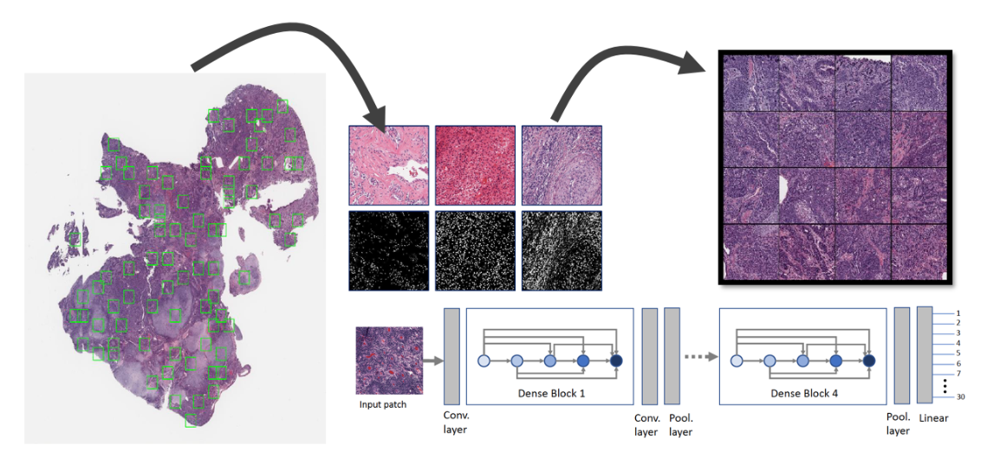
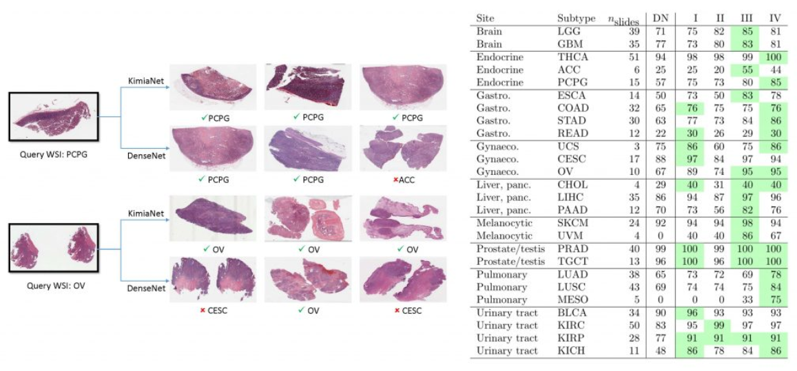

# KimiaNet - A Trained Network for Histopathology Image Representation 
### Paper Abstract
Feature vectors provided by pre-trained deep artificial neural networks have become a dominant source for image representation in recent literature. Their contribution to the performance of image analysis can be improved through fine-tuning. As an ultimate solution, one might even train a deep network from scratch with the domain-relevant images, a highly desirable option which is generally impeded in pathology by lack of labeled images and the computational expense. In this study, we propose a new network, namely KimiaNet, that employs the topology of the DenseNet with four dense blocks, fine-tuned and trained with histopathology images in different configurations. We used more than 240,000 image patches with 
 pixels acquired at 20
 magnification through our proposed “high-cellularity mosaic” approach to enable the usage of weak labels of 7126 whole slide images of formalin-fixed paraffin-embedded human pathology samples publicly available through The Cancer Genome Atlas (TCGA) repository. We tested KimiaNet using three public datasets, namely TCGA, endometrial cancer images, and colorectal cancer images by evaluating the performance of search and classification when corresponding features of different networks are used for image representation. As well, we designed and trained multiple convolutional batch-normalized ReLU (CBR) networks. The results show that KimiaNet provides superior results compared to the original DenseNet and smaller CBR networks when used as feature extractor to represent histopathology images.

 
 - KimiaNet has been trained with cellularity mosaics extracted from TCGA WSIs
 - See image source on [Kimia Lab](https://kimialab.uwaterloo.ca/kimia/index.php/data-and-code-2/kimia-net/)

 
 - KimiaNet features used for image search showed high accuracy for TCGA test WSIs
 - See image source on [Kimia Lab](https://kimialab.uwaterloo.ca/kimia/index.php/data-and-code-2/kimia-net/) and in the paper: [Fine-Tuning and Training of DenseNet for Histopathology Image Representation Using TCGA Diagnostic Slides](https://arxiv.org/pdf/2101.07903.pdf), figure 7 and table III.

### Useful Links
- [KimiaNet - Paper, pre-print on arXiv](https://arxiv.org/abs/2101.07903)
- [KimiaNet - Published in "Medical Image Analysis](https://www.sciencedirect.com/science/article/pii/S1361841521000785)
- [Learn more on Kimia Lab](https://kimialab.uwaterloo.ca/kimia/index.php/data-and-code-2/kimia-net/)
### Disclaimer
Kimia Lab at Mayo Clinic does not own the code in this repository. The code and data were produced in Kimia Lab at the University of Waterloo. The code is provided as-is without any guarantees, and is stored here as part of Kimia Lab's history. We welcome questions and comments.

This code is intended for research purposes only. Before using or cloning this repository, please read the [End User Agreement](agreement.pdf).
